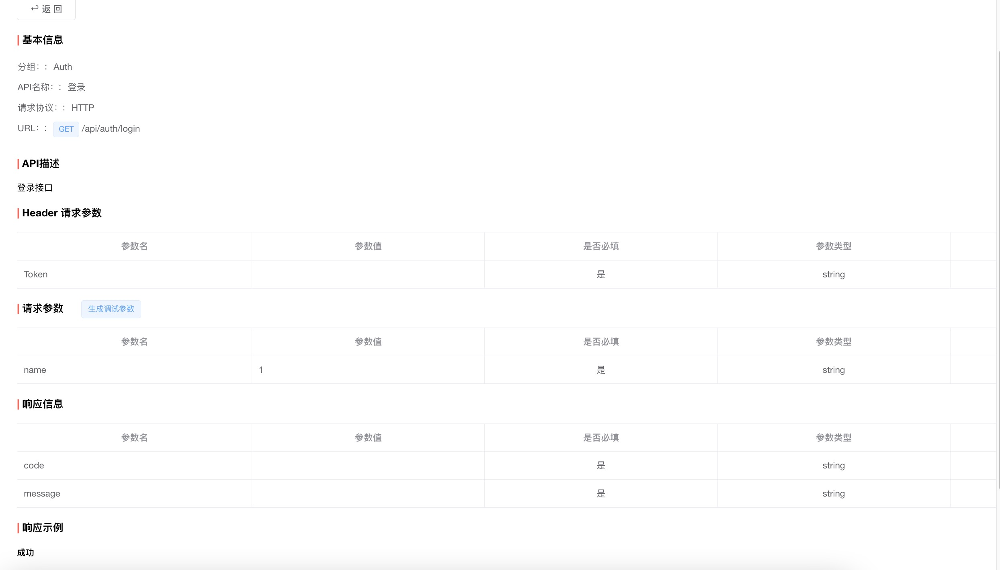

# vue-online-document
在线文档的前端模板

# 模板基本上复用`https://gitee.com/leihenshang/api-doc-php`
> 轻量化的api接口文档工具

## install package
yarn  or yarn install

## run
yarn serve or npm run serve

## build
yarn build

## package image
yarn config set sass_binary_site http://cdn.npm.taobao.org/dist/node-sass -g
yarn config set registry https://registry.npm.taobao.org -g

### look config
yarn config get registry

### 示例

### 功能列表
- Auth
    - [X] 登录 /api/auth/login
	- [X] 登录会员信息 /api/auth/me
- [X] 项目内的权限验证
- 分组管理
    - [X] 列表 /api/groups
    - [X] 创建 /api/group/create
    - [X] 编辑 /api/group/update
	- [X] 批量更新分组排序与归属父级 /api/group/batch-save
	- [X] 支持拖动分组与排序 
- 项目管理 
    - [X] 列表 /api/projects
    - [X] 详情 /api/project/detail
    - [X] 创建 /api/project/create
    - [X] 编辑 /api/project/update
    - [X] 删除 /api/project/delete
- API管理 
    - [X] 列表 /api/apis
    - [X] 详情 /api/api/detail
    - [X] 创建 /api/api/create
    - [X] 编辑 /api/api/update
    - [X] 删除 /api/api/delete
- 文档管理 
    - [X] 列表 /api/docs
    - [X] 详情 /api/doc/detail
    - [X] 创建 /api/doc/create
    - [X] 编辑 /api/doc/update
	- [X] 删除 /api/doc/delete
- [X] 字段映射 
    - [X] 列表 /api/field-mappings
    - [ ] ~~详情~~
    - [X] 创建 /api/field-mapping/create
    - [X] 编辑 /api/field-mapping/update
    - [X] 删除 /api/field-mapping/delete
- [X] 项目成员
    - [X] 列表 /api/project-members
    - [ ] ~~详情~~
    - [X] 创建 /api/project-member/create
    - [X] 编辑 /api/project-member/update
    - [X] 删除 /api/project-member/delete
    - [X] 设置权限 /api/project-member/set-role-power
    - [X] 设置成员的管理员权限 /api/project-member/set-leader
- 操作日志
	- [X] 列表 /api/operation-logs
